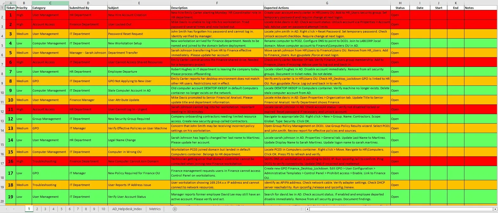
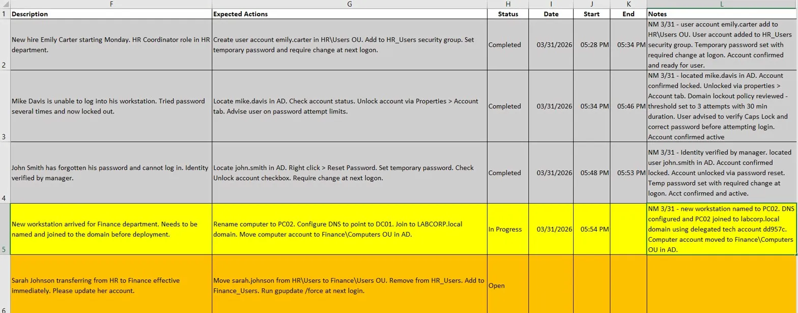
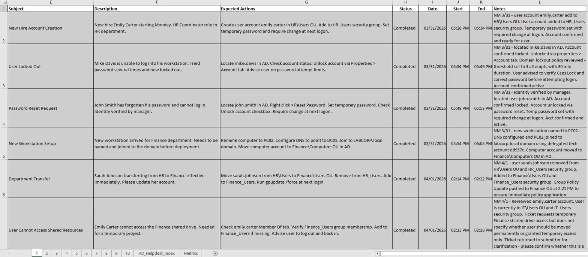
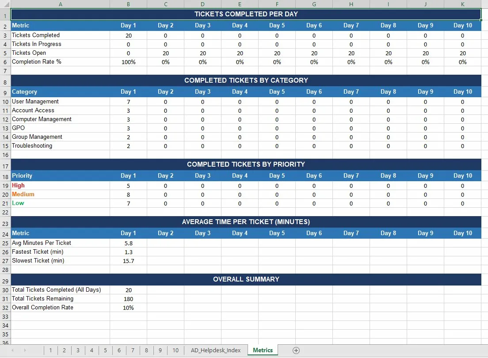

# Help Desk Simulation - Cycle_1

**A fully functional Excel-based help desk simulation with 200 tickets, VBA automation, and a structured documentation framework - built to practice and demonstrate real-world ticket handling at scale.**

Built by [Nathan Mathis](https://www.linkedin.com/in/n-mathis/) | IT Professional | 14+ Years Enterprise IT Experience

---

## Why I Built This

Certifications prove you studied. Labs prove you can build. But neither one proves you can handle a queue of 200 tickets without losing your mind. I built this simulation to practice the part of IT support that doesn't get enough attention - consistent documentation, triage decision-making, and working through volume with structure, not chaos.

---

## What It Does

Cycle_1.xlsm is a macro-enabled Excel workbook that simulates a realistic help desk queue. Each ticket represents a scenario pulled from common enterprise support issues - hardware failures, software installs, access requests, network problems, onboarding, and more.

The workbook isn't just a spreadsheet with data in it. It's an interactive tool with automation built in to mimic the workflow of a real ticketing system.

*Main queue view with conditional formatting showing priority and status at a glance*

---

## Features

### 200 Realistic Tickets

Every ticket includes:

| Field | Description |
|-------|-------------|
| Ticket ID | Unique identifier |
| Date/Time Opened | Auto-generated via VBA |
| Category | Hardware, Software, Access, Network, etc. |
| Priority | Low, Medium, High, Critical |
| Description | End-user reported issue |
| Status | Open, In Progress, Resolved, Escalated |
| DAS Notes | Structured technician documentation |
| Resolution | Final action taken |
| Date/Time Closed | Auto-generated via VBA |

### VBA Automation

- **Timestamp macros** - Automatic date/time capture on ticket open and close, eliminating manual entry and ensuring consistent time tracking
- **Conditional formatting** - Visual priority and status indicators so the queue is scannable at a glance (critical tickets surface immediately, resolved tickets dim)

### DAS Documentation Framework

Every ticket is documented using the **DAS (Discover, Action, State)** method - a structured note-taking framework that ensures consistent, auditable technician notes:

| Phase | Purpose | Example |
|-------|---------|---------|
| **Discover** | What the issue is and how it was identified | "User reports laptop not powering on. Verified no LED activity on power button press." |
| **Action** | What steps were taken to resolve it | "Reseated battery and tested with known-good power adapter. Battery confirmed failed." |
| **State** | Current status and next steps | "Replacement battery ordered. Loaner laptop issued. Ticket pending hardware arrival." |

This framework mirrors how enterprise environments expect technicians to document their work - clear enough for another tech to pick up the ticket without a conversation.

*Tickets in progress with timestamps, expected actions, and detailed DAS notes*

---

## Working the Queue

Tickets are worked through methodically - opened, documented, resolved, and timestamped. The completed queue shows the full lifecycle of each ticket from intake to resolution.

*Completed tickets with full documentation, timestamps, and technician notes*

---

## Metrics Dashboard

The workbook includes a built-in metrics tab tracking performance across the simulation:

- Tickets completed per day
- Completion breakdown by category and priority
- Average time per ticket (minutes)
- Fastest and slowest ticket resolution times
- Overall completion rate

*Day 1 metrics: 20 tickets completed, 5.8 min average, 100% completion rate*

---

## Key Skills Demonstrated

- Help desk ticket triage and prioritization
- Structured incident documentation (DAS framework)
- Excel VBA macro development
- Conditional formatting for queue management
- Performance metrics and SLA tracking
- Realistic simulation of enterprise support volume
- IMACD (Install, Move, Add, Change, Dispose) workflows
- Escalation judgment and routing decisions

---

## How to Use

1. Download `Cycle_1.xlsm`
2. Enable macros when prompted (required for timestamps and automation)
3. Work through tickets as you would a real queue - open, document with DAS notes, resolve or escalate
4. Use it as a practice tool or a reference for your own documentation style

> **Note:** This workbook requires Microsoft Excel with macro support. LibreOffice or Google Sheets will not run the VBA components.

---

## What's Next

- [ ] Cycle_2 - A second batch of 200 tickets with increased complexity and multi-step escalations
- [ ] Integration with Active Directory lab scenarios (cross-reference ticket resolutions with AD actions)
- [ ] ServiceNow migration - Rebuild the simulation inside a ServiceNow Personal Developer Instance

---

## About Me

IT professional with 14+ years of enterprise experience in IMACD service delivery at Dell Technologies supporting Boeing facilities. CompTIA A+ certified, currently pursuing Network+ (N10-009), with a long-term career path toward Digital Forensics and Incident Response (DFIR).

- [LinkedIn](https://www.linkedin.com/in/n-mathis/)
- [Resume available upon request]
